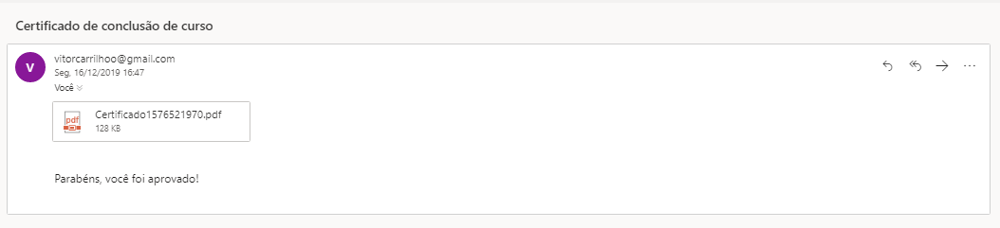
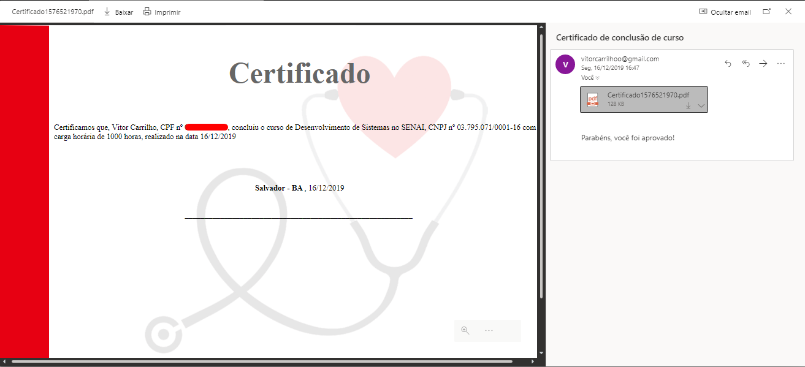

# Sistema de geração de certificados

Desafio proposto por mim mesmo, com o intuito de desenvolver um sistema capaz de gerar um certificado com dados de um formulário, e automaticamente enviar para o email do individuo.

## 1. Tela principal

  

## 2. Email recebido

  

## 3. PDF gerado

 

# Etapas necessarias para a execução do projeto

##### Ciar um arquivo chamado .env com as seguintes informações:


```
APP_NAME=Laravel
APP_ENV=local
APP_KEY=
APP_DEBUG=true
APP_URL=http://localhost

LOG_CHANNEL=stack

DB_CONNECTION=mysql
DB_HOST=127.0.0.1
DB_PORT=3306
DB_DATABASE=laravel
DB_USERNAME=root
DB_PASSWORD=

BROADCAST_DRIVER=log
CACHE_DRIVER=file
QUEUE_CONNECTION=sync
SESSION_DRIVER=file
SESSION_LIFETIME=120

REDIS_HOST=127.0.0.1
REDIS_PASSWORD=null
REDIS_PORT=6379

MAIL_DRIVER=smtp
MAIL_HOST=smtp.mailtrap.io
MAIL_PORT=2525
MAIL_USERNAME=null
MAIL_PASSWORD=null
MAIL_ENCRYPTION=null

AWS_ACCESS_KEY_ID=
AWS_SECRET_ACCESS_KEY=
AWS_DEFAULT_REGION=us-east-1
AWS_BUCKET=

PUSHER_APP_ID=
PUSHER_APP_KEY=
PUSHER_APP_SECRET=
PUSHER_APP_CLUSTER=mt1

MIX_PUSHER_APP_KEY="${PUSHER_APP_KEY}"
MIX_PUSHER_APP_CLUSTER="${PUSHER_APP_CLUSTER}"
```

###### alterar os campos conforme a necessidade
~~~
DB_HOST=127.0.0.1  
DB_PORT=3306  
DB_DATABASE=laravel  
DB_USERNAME=root  
DB_PASSWORD=
~~~
~~~
MAIL_DRIVER=smtp
MAIL_HOST=smtp.googlemail.com
MAIL_PORT=465
MAIL_USERNAME=***********@gmail.com
MAIL_PASSWORD=***********
MAIL_ENCRYPTION=ssl
~~~


##### na pasta raiz do projeto executar:
```composer install```  
```php artisan key:generate```  
```php artisan migrate```  
```php artisan db:seed```  
 
